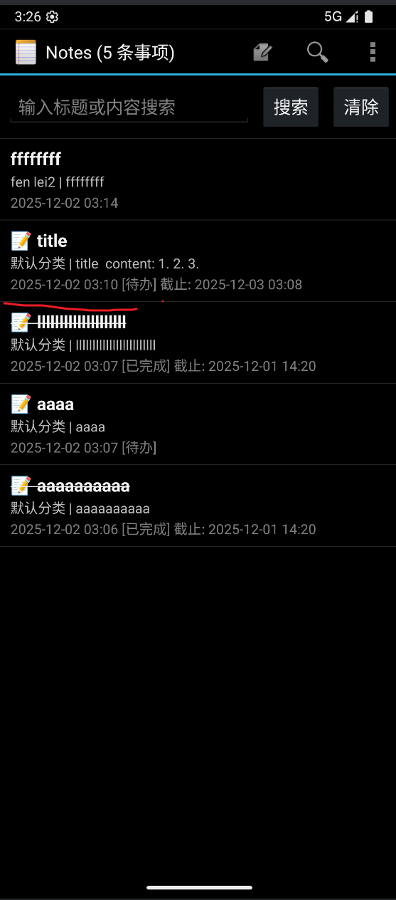
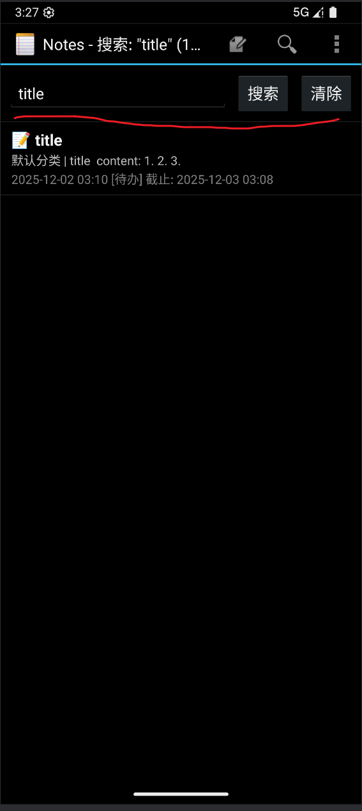
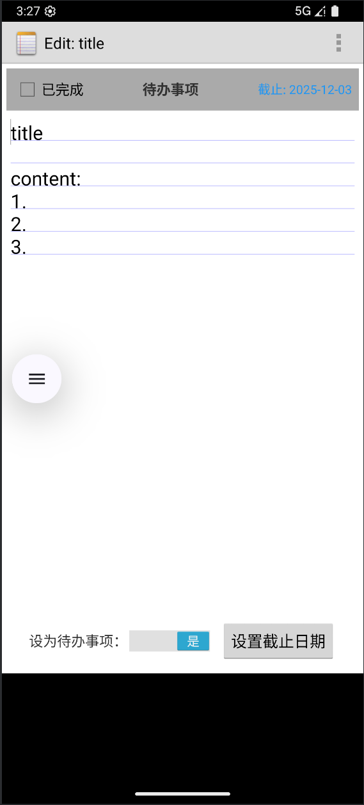
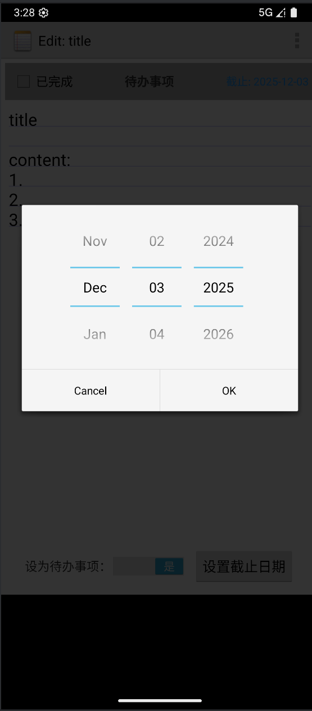
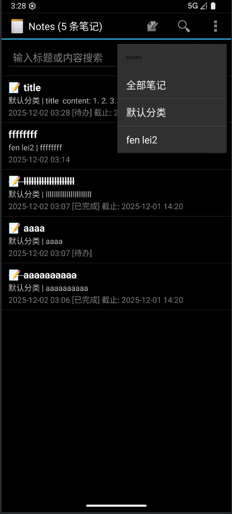
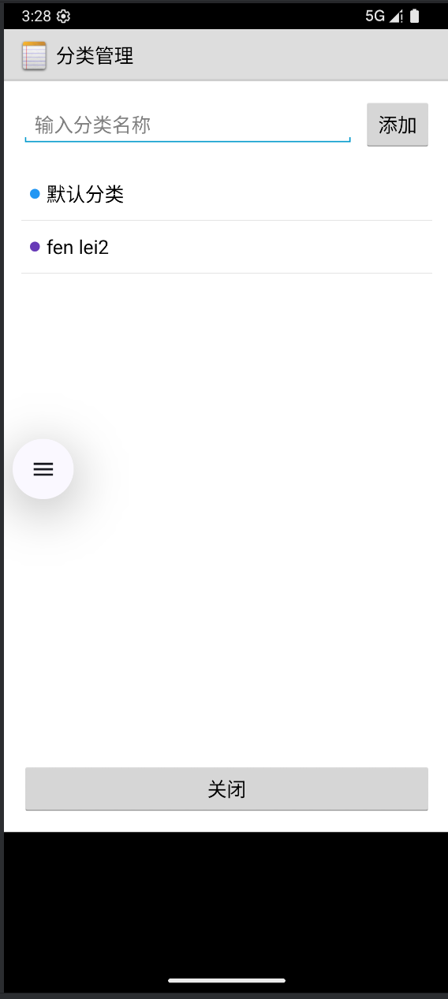

# Android记事本应用实验报告

## 一、实验概述

本实验基于Android平台开发了一个功能完善的记事本应用，实现了基础的笔记记录功能，并在此基础上进行了功能扩展，增加了时间戳显示、笔记查询、待办事项管理和笔记分类等实用功能。本报告将详细介绍这些功能的实现方法、技术要点以及用户体验优化。

## 二、项目结构

### 核心文件组织

```
app/src/main/java/com/example/android/notepad/
├── NotesList.java       # 笔记列表界面
├── NoteEditor.java      # 笔记编辑界面
├── CategoryManager.java # 分类管理界面
├── NotePadProvider.java # 内容提供者，数据库操作
└── NotePad.java         # 应用常量定义
```

### 主要功能模块

| 模块名称 | 主要职责 | 文件位置 |
|---------|---------|--------|
| 笔记列表 | 显示、搜索、筛选笔记 | NotesList.java |
| 笔记编辑 | 创建、编辑笔记、待办管理 | NoteEditor.java |
| 分类管理 | 添加、编辑、删除分类 | CategoryManager.java |
| 数据存储 | 提供内容访问、数据库操作 | NotePadProvider.java |

## 三、基础功能实现

### 1. NoteList界面中笔记条目增加时间戳显示

#### 功能描述
在笔记列表界面中，每条笔记条目增加了最后修改时间的显示，帮助用户快速识别笔记的更新状态和时间信息。



#### 技术实现
时间戳显示功能主要在`NotesList.java`文件的`setupAdapter()`方法中实现：

```java
private void setupAdapter() {
    // 获取修改日期列索引
    int columnIndex = mCursor.getColumnIndex(NotePad.Notes.COLUMN_NAME_MODIFICATION_DATE);
    
    // 格式化日期
    String formattedDate = formatDate(mCursor.getLong(columnIndex));
    
    // 在列表项中显示时间戳
    TextView dateView = (TextView) view.findViewById(R.id.note_date);
    dateView.setText(formattedDate);
}

// 日期格式化辅助方法
private String formatDate(long dateMillis) {
    SimpleDateFormat sdf = new SimpleDateFormat("yyyy-MM-dd HH:mm");
    return sdf.format(new Date(dateMillis));
}
```

#### 实现细节
- 使用`SimpleDateFormat`将数据库中的时间戳转换为用户友好的格式（年-月-日 时:分）
- 在笔记列表布局文件中添加了专门用于显示时间戳的TextView控件
- 时间戳信息从数据库的`MODIFICATION_DATE`字段直接读取
- 当笔记内容更新时，系统自动更新`MODIFICATION_DATE`字段

#### 用户体验设计
- 时间戳以较小字号显示在笔记标题下方，不干扰主要内容阅读
- 采用标准日期时间格式，确保用户容易理解
- 与笔记其他信息（标题、内容摘要）形成良好的视觉层次

### 2. 笔记查询功能实现

#### 功能描述
实现了基于关键词的笔记搜索功能，用户可以通过输入关键词在笔记的标题和内容中进行搜索，快速定位所需笔记。



#### 技术实现
搜索功能主要通过以下几个核心方法实现：

```java
// 初始化搜索视图
private void initSearchView() {
    mSearchLayout = findViewById(R.id.search_layout);
    mSearchEditText = findViewById(R.id.search_edit_text);
    
    // 设置搜索按钮点击事件
    findViewById(R.id.search_button).setOnClickListener(new View.OnClickListener() {
        @Override
        public void onClick(View v) {
            String query = mSearchEditText.getText().toString();
            if (!query.isEmpty()) {
                performSearch(query);
            }
        }
    });
}

// 执行搜索操作
private void performSearch(String query) {
    // 构建搜索条件
    String selection = NotePad.Notes.COLUMN_NAME_TITLE + " LIKE ? OR " + 
                      NotePad.Notes.COLUMN_NAME_NOTE + " LIKE ?";
    String[] selectionArgs = new String[]{"%" + query + "%", "%" + query + "%"};
    
    // 执行查询
    mCursor = managedQuery(NotePad.Notes.CONTENT_URI,
                          PROJECTION,
                          selection,
                          selectionArgs,
                          NotePad.Notes.DEFAULT_SORT_ORDER);
    
    // 更新列表显示
    updateAdapter();
    updateTitle(query); // 更新标题显示搜索状态
}
```

#### 查询优化实现
为了支持复杂的查询场景，实现了动态构建查询条件的方法，支持搜索、分类和待办筛选的组合使用：

```java
private void performQuery(String searchQuery, long categoryFilter, boolean todoFilter) {
    // 构建动态查询条件
    StringBuilder selectionBuilder = new StringBuilder();
    List<String> selectionArgs = new ArrayList<>();
    
    // 添加搜索条件
    if (searchQuery != null && !searchQuery.isEmpty()) {
        selectionBuilder.append("(" + NotePad.Notes.COLUMN_NAME_TITLE + " LIKE ? OR ");
        selectionBuilder.append(NotePad.Notes.COLUMN_NAME_NOTE + " LIKE ?)");
        selectionArgs.add("%" + searchQuery + "%");
        selectionArgs.add("%" + searchQuery + "%");
    }
    
    // 添加分类筛选条件
    if (categoryFilter > 0 && categoryFilter != mDefaultCategoryId) {
        if (selectionBuilder.length() > 0) {
            selectionBuilder.append(" AND ");
        }
        selectionBuilder.append(NotePad.Notes.COLUMN_NAME_CATEGORY_ID + " = ?");
        selectionArgs.add(String.valueOf(categoryFilter));
    }
    
    // 执行查询
    mCursor = managedQuery(NotePad.Notes.CONTENT_URI,
                          PROJECTION,
                          selectionBuilder.toString(),
                          selectionArgs.toArray(new String[0]),
                          NotePad.Notes.DEFAULT_SORT_ORDER);
}
```

#### 用户体验设计
- 搜索框位于界面顶部，易于访问
- 支持点击搜索按钮和键盘回车键两种搜索方式
- 搜索结果实时更新到当前列表，无需页面跳转
- 界面标题显示当前搜索关键词和结果数量
- 提供清除搜索按钮，一键恢复显示所有笔记

## 四、附加功能实现

### 1. 待办事项功能

#### 功能描述
将普通笔记转换为待办事项，支持标记完成状态、设置截止日期，并提供状态视觉反馈。





#### 核心数据结构
在笔记数据库表中增加了以下字段：

```sql
ALTER TABLE notes ADD COLUMN is_todo INTEGER DEFAULT 0;
ALTER TABLE notes ADD COLUMN is_completed INTEGER DEFAULT 0;
ALTER TABLE notes ADD COLUMN due_date INTEGER DEFAULT -1;
```

#### 技术实现
待办事项功能主要在`NoteEditor.java`文件中实现：

```java
// 初始化待办事项相关控件
mTodoSection = (LinearLayout) findViewById(R.id.todo_section);
mTodoCheckbox = (CheckBox) findViewById(R.id.todo_checkbox);
mDueDateText = (TextView) findViewById(R.id.due_date_text);
mTodoSwitch = (Switch) findViewById(R.id.todo_switch);
mSetDueDateButton = (Button) findViewById(R.id.set_due_date_button);

// 设置待办事项开关的监听器
mTodoSwitch.setOnCheckedChangeListener(new CompoundButton.OnCheckedChangeListener() {
    @Override
    public void onCheckedChanged(CompoundButton buttonView, boolean isChecked) {
        mIsTodo = isChecked;
        updateTodoUI(); // 更新UI显示
        saveNoteContent(); // 保存状态到数据库
    }
});

// 更新待办事项UI
private void updateTodoUI() {
    if (mIsTodo) {
        // 显示待办事项相关控件
        mTodoSection.setVisibility(View.VISIBLE);
        mSetDueDateButton.setVisibility(View.VISIBLE);
    } else {
        // 隐藏待办事项相关控件
        mTodoSection.setVisibility(View.GONE);
        mSetDueDateButton.setVisibility(View.GONE);
        // 重置状态
        mIsCompleted = false;
        mDueDate = -1;
    }
}
```

#### 截止日期设置与显示
```java
// 日期选择监听器
private DatePickerDialog.OnDateSetListener mDateSetListener = new DatePickerDialog.OnDateSetListener() {
    @Override
    public void onDateSet(DatePicker view, int year, int monthOfYear, int dayOfMonth) {
        mDueDateCalendar.set(Calendar.YEAR, year);
        mDueDateCalendar.set(Calendar.MONTH, monthOfYear);
        mDueDateCalendar.set(Calendar.DAY_OF_MONTH, dayOfMonth);
        
        // 保存截止日期
        mDueDate = mDueDateCalendar.getTimeInMillis();
        saveNoteContent();
        updateDueDateText();
    }
};

// 更新截止日期显示
private void updateDueDateText() {
    if (mDueDate > 0) {
        SimpleDateFormat sdf = new SimpleDateFormat("yyyy-MM-dd");
        String dateString = sdf.format(mDueDateCalendar.getTime());
        
        // 根据状态设置不同的显示样式
        if (mIsCompleted) {
            mDueDateText.setText("完成 - " + dateString);
            mDueDateText.setTextColor(getResources().getColor(R.color.completed_task_color));
        } else {
            // 检查是否过期
            if (mDueDateCalendar.before(Calendar.getInstance())) {
                mDueDateText.setText("过期! " + dateString);
                mDueDateText.setTextColor(getResources().getColor(R.color.overdue_task_color));
            } else {
                mDueDateText.setText("截止: " + dateString);
            }
        }
    }
}
```

#### 待办事项筛选功能
在笔记列表界面中实现了待办事项的筛选功能，用户可以选择只查看待办事项或已完成事项：

```java
// 待办事项筛选菜单设置
MenuItem todoMenuItem = menu.add("待办事项");
todoMenuItem.setOnMenuItemClickListener(new MenuItem.OnMenuItemClickListener() {
    @Override
    public boolean onMenuItemClick(MenuItem item) {
        mCurrentFilter = FILTER_TODO;
        refreshNotesList();
        return true;
    }
});
```

#### 用户体验设计
- 通过开关切换普通笔记和待办事项模式
- 待办事项支持勾选标记完成状态
- 截止日期显示不同的颜色状态：正常、过期、已完成
- 在笔记列表中可以筛选查看待办事项
- 待办事项状态与普通笔记内容集成，无需切换应用

### 2. 笔记分类功能

#### 功能描述
实现了笔记分类管理功能，用户可以创建、编辑、删除分类，并将笔记归类到不同的分类中，方便组织和管理笔记内容。





#### 数据库设计
创建了专门的分类表来存储分类信息：

```sql
CREATE TABLE categories (
    _id INTEGER PRIMARY KEY AUTOINCREMENT,
    category_name TEXT NOT NULL,
    category_color INTEGER NOT NULL,
    create_date INTEGER NOT NULL
);

-- 在笔记表中添加分类引用
ALTER TABLE notes ADD COLUMN category_id INTEGER DEFAULT 1;
```

#### 分类管理实现
分类管理界面`CategoryManager.java`提供了完整的分类CRUD操作：

```java
// 添加新分类
private void addCategory() {
    String categoryName = etCategoryName.getText().toString().trim();
    if (categoryName.isEmpty()) {
        Toast.makeText(this, "请输入分类名称", Toast.LENGTH_SHORT).show();
        return;
    }

    ContentValues values = new ContentValues();
    values.put(NotePad.Categories.COLUMN_NAME_CATEGORY_NAME, categoryName);
    values.put(NotePad.Categories.COLUMN_NAME_CATEGORY_COLOR, getRandomColor());
    values.put(NotePad.Categories.COLUMN_NAME_CREATE_DATE, System.currentTimeMillis());

    getContentResolver().insert(NotePad.Categories.CONTENT_URI, values);
    loadCategories(); // 刷新分类列表
}

// 删除分类
private void deleteCategory(Category category) {
    // 检查是否有笔记使用该分类
    Cursor cursor = getContentResolver().query(
            NotePad.Notes.CONTENT_URI,
            new String[]{NotePad.Notes._ID},
            NotePad.Notes.COLUMN_NAME_CATEGORY_ID + "=?",
            new String[]{String.valueOf(category.id)},
            null
    );

    if (cursor != null && cursor.getCount() > 0) {
        // 提示用户笔记将被转移到默认分类
        new AlertDialog.Builder(this)
                .setTitle("删除分类")
                .setMessage("该分类下有 " + cursor.getCount() + " 篇笔记，删除后将转移到默认分类")
                .setPositiveButton("确定", new DialogInterface.OnClickListener() {
                    @Override
                    public void onClick(DialogInterface dialog, int which) {
                        // 转移笔记到默认分类
                        ContentValues values = new ContentValues();
                        values.put(NotePad.Notes.COLUMN_NAME_CATEGORY_ID, 1);
                        getContentResolver().update(
                                NotePad.Notes.CONTENT_URI,
                                values,
                                NotePad.Notes.COLUMN_NAME_CATEGORY_ID + "=?",
                                new String[]{String.valueOf(category.id)}
                        );
                        deleteCategoryFromDb(category.id);
                    }
                })
                .show();
    }
}
```

#### 笔记分类实现
在笔记列表界面实现了分类筛选和显示功能：

```java
// 设置分类菜单
private void setupCategoryFilterMenu(Menu menu) {
    // 加载所有分类
    Cursor cursor = getContentResolver().query(
            NotePad.Categories.CONTENT_URI,
            new String[]{NotePad.Categories._ID, NotePad.Categories.COLUMN_NAME_CATEGORY_NAME},
            null, null, null
    );

    if (cursor != null) {
        while (cursor.moveToNext()) {
            long categoryId = cursor.getLong(0);
            String categoryName = cursor.getString(1);
            
            // 添加分类菜单项
            MenuItem item = menu.add(categoryName);
            item.setOnMenuItemClickListener(new CategoryMenuItemClickListener(categoryId));
        }
        cursor.close();
    }
}

// 分类菜单项点击监听器
private class CategoryMenuItemClickListener implements MenuItem.OnMenuItemClickListener {
    private long categoryId;
    
    public CategoryMenuItemClickListener(long id) {
        this.categoryId = id;
    }
    
    @Override
    public boolean onMenuItemClick(MenuItem item) {
        mCurrentCategoryFilter = categoryId;
        refreshNotesList(); // 刷新列表显示该分类的笔记
        return true;
    }
}
```

#### 分类显示与交互
在笔记列表项中显示分类信息，并使用颜色标识：

```java
// 在setupAdapter中显示分类信息
private void setupAdapter() {
    // 获取分类ID
    int categoryIndex = mCursor.getColumnIndex(NotePad.Notes.COLUMN_NAME_CATEGORY_ID);
    long categoryId = mCursor.getLong(categoryIndex);
    
    // 显示分类信息
    TextView categoryView = (TextView) view.findViewById(R.id.note_category);
    String categoryName = getCategoryInfo(categoryId);
    if (categoryName != null) {
        categoryView.setText(categoryName);
        categoryView.setBackgroundColor(getCategoryColor(categoryId));
        categoryView.setVisibility(View.VISIBLE);
    } else {
        categoryView.setVisibility(View.GONE);
    }
}
```

#### 用户体验设计
- 分类管理界面提供直观的添加、编辑、删除操作
- 分类使用不同的颜色标识，增强视觉区分度
- 删除分类时自动处理关联笔记，防止数据丢失
- 笔记列表支持按分类筛选，快速查看特定分类的笔记
- 新笔记可以直接选择分类，方便归类

## 五、技术要点总结

### 1. ContentProvider使用

采用ContentProvider模式管理应用数据，提供了统一的数据访问接口，支持笔记和分类数据的增删改查操作，实现了数据层与UI层的解耦。

### 2. 动态查询优化

实现了动态构建查询条件的机制，支持搜索、分类和待办筛选的组合使用，提供了灵活而强大的数据查询能力，同时保证了查询性能。

### 3. UI组件复用

通过条件显示和动态更新UI组件，在同一界面中实现了普通笔记和待办事项两种模式，减少了界面切换，提高了用户操作效率。

### 4. 状态管理与保存

实现了完善的状态保存机制，确保应用在配置变更（如屏幕旋转）或暂时离开时能够正确保存和恢复用户数据和界面状态。

### 5. 数据完整性保护

在删除分类等敏感操作中，实现了数据完整性检查和自动数据迁移，防止误操作导致的数据丢失，提高了应用的健壮性。

## 六、实验总结

### 功能实现总结

本实验成功实现了一个功能丰富的Android记事本应用，包含以下核心功能：

1. **基础功能**
   - 笔记创建、编辑和删除
   - 笔记时间戳显示
   - 笔记关键词搜索

2. **高级功能**
   - 待办事项管理（状态标记、截止日期）
   - 笔记分类系统（创建、编辑、筛选）
   - 多状态筛选（搜索+分类+待办组合）

### 技术收获

1. 深入理解了Android应用的架构设计和组件交互
2. 掌握了ContentProvider的使用和数据库操作优化
3. 学习了如何构建灵活的查询系统和用户界面
4. 了解了Android应用中的状态管理和数据保存机制
5. 掌握了用户体验设计原则在实际开发中的应用

### 未来改进方向

1. 增加云同步功能，实现跨设备数据同步
2. 支持笔记内容的富文本编辑
3. 添加笔记备份和恢复功能
4. 实现更高级的搜索功能，如全文检索和搜索历史
5. 优化应用性能，特别是在处理大量笔记数据时

通过本次实验，不仅学习了Android应用开发的核心技术，还培养了将用户需求转化为实际功能的能力，为今后开发更复杂的移动应用奠定了坚实的基础。